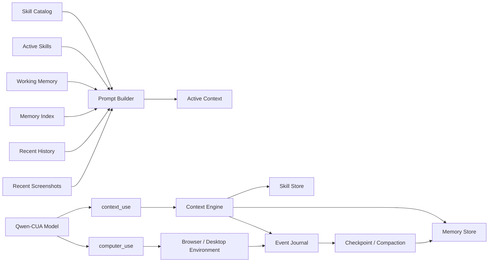

# Qwen-CUA Skill 与主动 Context Memory 设计

- 状态：Proposal
- 目标分支：`codex/context-skill-memory`
- 适用范围：本地 FastAPI/Playwright runner、OSWorld adapter、CUA-Gym adapter
- 最后更新：2026-08-03

## 1. 摘要

本文提出两项相互配合但职责分离的能力：

1. **Skill progressive disclosure**：启动时只向模型暴露 Skill 的名称、用途和版本；模型判断相关后，通过 context tool 主动加载完整 `SKILL.md`，必要时继续加载引用资源。
2. **主动 Context Memory**：完整执行轨迹保存在模型 Context 之外；模型以 task/event 为单位产生结构化 checkpoint，harness 在 Context 接近预算时触发压缩，并允许模型搜索、加载以前的记忆。

核心决策如下：

- Skill 是稳定、可复用、版本化的程序性知识；Memory 是带来源的运行时经历。两者不能混成同一种内容。
- Skill 与 Memory 共用“发现—加载—卸载”的 Context Resource 机制，但使用不同 namespace、存储、权限和生命周期。
- Memory 应支持多模态，但不是保存并回放所有完整截图。第一版采用“**文本 capsule 为主，关键帧或 action-grounded ROI 为视觉证据，原始截图仅作为可追溯 artifact**”。
- 模型负责语义边界和摘要内容；harness 负责预算监控、强制兜底、持久化、校验和安全边界。不能只依赖模型自觉压缩。
- 原始 event journal 永不因压缩而删除。压缩只改变下一次推理时组装进 Context 的内容。
- OSWorld/CUA-Gym 默认使用 run-local memory，禁止跨 benchmark task 检索，避免评测数据泄漏。

## 2. 背景与现状

当前 harness 的历史由四个平行结构组成：

- `screenshots`
- `responses`
- `action_summaries`
- `feedback`

`AgentHistory.build_messages()` 使用两个固定窗口：

- `history_n`：保留多少轮完整文本。
- `image_max`：保留多少张最近截图。

超出 `history_n` 的轮次只留下 `action_summaries`；较老截图被替换为 `This screenshot has been collapsed.`。这种机制简单、确定、适合短任务，但有以下局限：

1. 压缩单位是固定轮次，而不是语义 task/event。
2. 旧历史只剩动作列表，目标、决策、失败原因、页面状态和未完成事项容易丢失。
3. 模型不能主动声明“这一阶段已经完成，可以压缩”。
4. 模型不能在后续按需找回被省略的信息。
5. 截图只有“保留整张”或“全部丢弃”两个状态，没有关键帧、局部区域和视觉证据层。
6. 本地 runner 与 OSWorld adapter 分别实现了一份 history 逻辑，扩展后容易漂移。
7. 当前 XML parser 只接受 `computer_use`，没有 harness 内部的 context control tool。

## 3. 设计目标

### 3.1 功能目标

- 支持兼容 Agent Skills 目录结构的 Skill 注册、发现、加载和资源读取。
- 模型能基于 metadata 自主决定是否加载 Skill。
- 模型能将阶段性工作以 task 或 event group 为单位写入结构化 Memory。
- harness 能根据 token、图像和轮次数量预算触发压缩。
- 模型能搜索并重新加载已压缩的 task/event Memory。
- 支持文本和选择性视觉证据共同构成 Memory。
- 本地 runner、OSWorld、CUA-Gym 使用同一套 Context Engine。
- 完整轨迹、压缩结果、检索过程和实际注入内容均可审计、可回放。

### 3.2 质量目标

- 相同输入、配置和模型输出能够确定性地重建 messages。
- Skill/Memory 加载有明确 token 与 image budget。
- 压缩失败不会破坏原始轨迹，也不会让 run 无法继续。
- 不允许通过 Skill/Memory 路径访问授权目录以外的文件。
- 对 benchmark 默认关闭跨任务学习，保证结果可比较。

### 3.3 非目标

第一版不包含：

- 自动生成或自动修改长期 Skill。
- 执行第三方 Skill 内任意脚本。
- 跨用户共享 Memory。
- 基于大规模向量数据库的全局语义检索。
- 训练一个专用 memory controller。
- 用 Memory 替代完整的 run event/replay 数据。
- 在不做消融实验的情况下默认启用跨 run 经验学习。

## 4. 依据与设计原则

Agent Skills 的开放规范采用三级 progressive disclosure：启动时加载 metadata，激活时加载完整 `SKILL.md`，执行时才加载额外资源。参见 [Agent Skills specification](https://github.com/agentskills/agentskills) 与 [agentskills.io specification](https://agentskills.io/specification)。

Context 应视为有限资源，并持续筛选高信号内容，而不是无限增长的日志容器。参见 Anthropic 的 [Effective context engineering for AI agents](https://www.anthropic.com/engineering/effective-context-engineering-for-ai-agents)。

Memory 的价值在于把信息保存在应用控制的外部存储中，并在需要时 just-in-time retrieval，而不是每轮都放入 Context。参见 [Claude Memory tool](https://platform.claude.com/docs/en/agents-and-tools/tool-use/memory-tool)。

在长任务中，常见的可靠模式是监控 Context 使用量，在阈值处生成压缩表示并替换旧的活动历史，同时在外部保留完整状态。参见 [OpenAI Responses API compaction](https://openai.com/index/equip-responses-api-computer-environment/) 和 [Claude context editing](https://platform.claude.com/docs/en/build-with-claude/context-editing)。

对于 GUI agent，纯文本记忆会丢失视觉状态，而直接回放大量完整截图会制造冗余并可能导致错误 grounding。近期工作建议选择 task-relevant screenshot/ROI，而非无差别全图记忆：

- [MementoGUI](https://arxiv.org/abs/2605.18652) 使用文本摘要与 ROI 级视觉证据构成选择性 working/episodic memory。
- [Chain-of-Memory](https://arxiv.org/abs/2506.18158) 显式保存 action description、task-relevant screen information 与长期记忆。
- [Naive Visual Memory is Not Enough](https://arxiv.org/abs/2606.14106) 报告完整截图记忆可能恶化 action grounding，并提出 action-grounded image crop。

由此得到五条实现原则：

1. **Storage is not Context**：保存了不等于每轮都要注入。
2. **Text first, vision as evidence**：文本负责检索与状态，视觉负责无法可靠文字化的证据。
3. **Model proposes, harness guarantees**：模型提出语义 checkpoint，harness 保证预算与持久化。
4. **Provenance before cleverness**：所有摘要必须能追溯到 event 和 artifact。
5. **Benchmark isolation by default**：评测任务之间不共享动态 Memory。

## 5. 概念模型



### 5.1 Skill

稳定、可复用的程序性知识，例如：

- 如何在 LibreOffice Impress 中安全编辑母版。
- 某类网站的操作流程。
- 特定任务的验证清单。

Skill 有明确版本和信任来源，不记录某次 run 的临时状态。

### 5.2 Event

Event 是不可变的最小事实记录，由 harness 自动生成。典型 event：

- observation captured
- model response
- context tool call/result
- computer action requested/executed
- safety intervention
- user intervention
- verification result
- task checkpoint created

Event 不是每次都让模型总结。动作名、反馈、截图引用等应确定性写入，避免额外模型调用。

### 5.3 Task

Task 是一组有语义目标的 event，可以嵌套：

```text
run goal
└── task: 创建演示文稿
    ├── task: 创建标题页
    ├── task: 创建内容页
    └── task: 保存并验证
```

Task 边界主要由模型声明，harness 可在明显边界处提示：

- 一个阶段完成。
- 应用发生切换。
- 用户/审批中断前后。
- Context 达到 soft threshold。

### 5.4 Memory Capsule

Memory Capsule 是 event/task 的结构化压缩表示。它不是 source of truth，只是可检索投影。

### 5.5 Working Memory 与 Episodic Memory

- **Working Memory**：当前 task、最近 event、当前 UI 状态、未完成事项；默认自动注入。
- **Episodic Memory**：已经结束或离开活动窗口的 task/event capsule；只注入 metadata，正文按需加载。
- **Semantic Memory**：从多次经历中提炼的稳定事实。第一版不自动生成，避免与 Skill 混淆和 benchmark 泄漏。

### 5.6 为什么不把旧 Context 生成为动态 Skill

“把旧 Context 压缩后当作 Skill，再通过 skill load 取回”在接口上很简洁，但会混淆信任和生命周期：

- Skill 正文会以高优先级指令进入 system context；运行轨迹中的网页内容、模型判断和临时状态不应自动获得这个权限。
- Skill 适合跨 run 复用，task/event Memory 默认只能在当前 run 使用。
- Skill 由作者维护并版本化；Memory 由运行过程生成，必须记录 source event、时间和不确定性。
- Skill 的“加载”意味着遵循工作流；Memory 的“加载”意味着读取历史证据，模型仍需判断它是否过时。

因此两者共用 `context_use` 和 URI loader，但 namespace 与注入优先级不同：

```text
skill://...   → trusted instructions，激活后进入 system Active Skills
memory://...  → historical evidence，进入有明确来源标签的 context/tool data
visual://...  → historical image evidence，始终标记为非当前画面
```

如果未来从多次成功经历提炼出新 Skill，也必须经过独立的生成、审阅、批准和版本发布流程，不能把单次 Memory 直接晋升为 Skill。

## 6. Skill 系统设计

### 6.1 目录结构

```text
skills/
└── libreoffice-impress/
    ├── SKILL.md
    ├── references/
    │   ├── layouts.md
    │   └── verification.md
    ├── scripts/
    └── assets/
```

最小 `SKILL.md`：

```yaml
---
name: libreoffice-impress
description: Use when creating, editing, formatting, or verifying presentations in LibreOffice Impress through the GUI.
license: Apache-2.0
metadata:
  version: "1.0.0"
  surfaces: [desktop]
---

# LibreOffice Impress

...instructions...
```

第一版至少校验：

- `name`、`description` 必须存在。
- directory name 与 `name` 一致。
- name 只能包含小写字母、数字、连字符。
- `SKILL.md` 和资源文件必须位于 Skill root 内。
- 单文件与累计加载大小不能超过配置预算。
- symlink 解析后不能逃逸 Skill root。
- UTF-8 解码失败时拒绝注册。

### 6.2 Catalog

启动或显式 reload 时扫描 Skill roots，产生不可变 catalog snapshot：

```json
{
  "name": "libreoffice-impress",
  "description": "Use when ...",
  "version": "1.0.0",
  "digest": "sha256:...",
  "source": "repo",
  "trust": "trusted",
  "surfaces": ["desktop"]
}
```

System prompt 中只放与当前 surface、scenario policy 匹配的 metadata：

```xml
<available_skills>
  <skill name="libreoffice-impress"
         version="1.0.0"
         description="Use when creating, editing, formatting, or verifying presentations in LibreOffice Impress through the GUI." />
</available_skills>
```

Catalog 必须保持短小。Skill 数量很大时，第一层可先按 category/surface 过滤；后续再考虑 catalog search。

### 6.3 激活与注入

模型调用：

```xml
<tool_call>
<function=context_use>
<parameter=action>
load_skill
</parameter>
<parameter=ref>
skill://libreoffice-impress
</parameter>
</function>
</tool_call>
```

Context Engine 完成以下步骤：

1. 从当前 catalog snapshot 解析 Skill。
2. 检查 surface、trust、大小与并发加载上限。
3. 读取并校验完整 `SKILL.md`。
4. 将 `{name, version, digest}` 加入 active skill set。
5. 不消耗 environment step，进入一次内部 model hop。
6. 下一次 prompt 将 Skill 正文放入 system message 的 `Active Skills` 区域。
7. 同时返回简短 tool response，说明加载成功或失败。

Skill 正文属于受信任指令，不应仅作为普通 user/tool feedback 注入。引用资料可能包含外部数据，默认作为带边界的 resource/tool response 注入，不自动提升为 system instruction。

### 6.4 Resource 加载

```xml
<tool_call>
<function=context_use>
<parameter=action>
load_skill_resource
</parameter>
<parameter=ref>
skill://libreoffice-impress/references/verification.md
</parameter>
</function>
</tool_call>
```

返回内容包含：

- canonical URI
- version/digest
- MIME type
- 是否截断
- 正文

第一版只允许文本资源进入 Context。图片 asset 可以在多模态 resource loader 完成后开放。

### 6.5 激活生命周期

- 默认 Skill 在当前 run 中保持激活。
- 可配置 `max_active_skills`，建议默认 3。
- 超出 token budget 时，模型或 harness 可以 deactivate 最久未使用的 Skill。
- deactivate 不删除 catalog metadata，只移除正文。
- active skill 的版本在 run 内固定；磁盘上的 Skill 更新只影响新 run，保证可复现。

### 6.6 脚本与权限

第一版不执行 `scripts/`：

- 当前 Qwen-CUA contract 明确要求只通过可见 GUI 操作。
- OSWorld/CUA-Gym 中执行 Skill 脚本会改变 agent capability 和 benchmark 公平性。
- 第三方脚本还需要独立 sandbox、权限声明和审批模型。

未来若开放，必须按 Skill 声明 capability，并区分 `read_resource`、`execute_script` 与 GUI action 权限。

## 7. Context Tool 协议

### 7.1 为什么使用一个 `context_use`

当前模型已经熟悉 `computer_use(action=...)`。第一版增加一个同风格的 `context_use`，比增加四到六个独立 function 更节省 prompt，也更容易让 Qwen 稳定输出 XML。

支持的 action：

```text
load_skill
load_skill_resource
search_memory
load_memory
write_checkpoint
deactivate_resource
```

通用参数：

```json
{
  "action": "load_memory",
  "ref": "memory://run/task-07",
  "query": null,
  "include_images": false,
  "image_ids": [],
  "payload": null,
  "limit": 5
}
```

### 7.2 内部 tool loop

Context tool 不应直接消耗 OSWorld/CUA-Gym 的 environment step。单个 `predict()` 内部允许：

```text
build messages
→ model calls context_use
→ harness executes context operation
→ rebuild messages
→ model calls computer_use
→ return environment action
```

约束：

- 单次 environment step 最多 3 个 context hops。
- `context_use` 与 `computer_use` 不允许在同一 assistant response 混用。
- `load_*` 后必须重新推理，不能在同一 response 假装使用尚未加载的内容。
- 超过 hop 限制时返回可诊断错误，并要求模型基于当前信息行动或终止。
- 每个 hop 写入 event journal，但不增加 environment action count。

### 7.3 Parser 重构

当前 `parse_tool_calls()` 返回 `list[ComputerAction]`。应改为两层：

```text
parse_xml_tool_calls(response) -> list[RawToolCall]
validate_tool_calls(raw)       -> list[ComputerAction | ContextAction]
```

通用 parser 只负责 XML 结构和 parameter 解码；具体 function 交给各自 Pydantic adapter 校验。这样 repair error 能明确指出是 XML 错误、未知 function，还是参数 schema 错误。

参数解码需要同时支持 JSON array/object、boolean、integer、float 和保留换行的 text/payload，不能继续只针对 `computer_use` 的少数字段做类型转换。

## 8. Event Journal

### 8.1 不可变事件

建议统一事件 envelope：

```json
{
  "id": "event-000042",
  "run_id": "run-...",
  "sequence": 42,
  "timestamp": "2026-08-03T14:00:00Z",
  "type": "computer_action_executed",
  "task_id": "task-07",
  "turn": 11,
  "payload": {},
  "artifact_refs": ["screenshot://run/shot-0012"],
  "sensitive": false
}
```

Event 只追加，不原地修改。需要纠正时追加 correction event。

### 8.2 事件类型

至少包含：

```text
run_started
observation_captured
model_response
context_action_requested
context_action_completed
computer_action_requested
computer_action_executed
safety_intervention
user_intervention
verification_completed
checkpoint_written
compaction_applied
memory_loaded
run_completed
run_failed
```

### 8.3 敏感数据

- `type` action 的原文默认不进入结构化摘要。
- Capsule 继承 source event 的敏感标记。
- 敏感截图可以保存到受控 artifact store，但不生成跨 run embedding。
- 日志、Memory 和 replay 使用同一 redaction policy，避免某一层意外泄漏。

## 9. Task 与 Checkpoint

### 9.1 Checkpoint schema

```json
{
  "schema_version": 1,
  "id": "task-07",
  "parent_id": "task-01",
  "kind": "task",
  "title": "创建标题页",
  "goal": "建立带标题和副标题的第一页",
  "status": "completed",
  "summary": "已创建标题页并确认文本可见。",
  "completed": [
    "输入标题 Happy Family",
    "将标题居中"
  ],
  "current_state": [
    "当前位于第 1 页",
    "标题框仍被选中"
  ],
  "decisions": [
    {"decision": "采用蓝色背景", "reason": "符合用户要求"}
  ],
  "facts": [
    {"key": "slide_count", "value": 1, "confidence": 0.96}
  ],
  "failures": [
    {"attempt": "选择字体", "result": "未生效", "avoid": "先点击文本框内部"}
  ],
  "artifacts": [
    {"ref": "artifact://run/presentation.odp", "role": "output"}
  ],
  "visual_evidence": [
    {"ref": "visual://run/roi-0012", "role": "completion-proof"}
  ],
  "open_items": [],
  "next_steps": ["创建第二页"],
  "skills_used": ["skill://libreoffice-impress@1.0.0"],
  "source_events": ["event-000031", "event-000042"],
  "created_at": "2026-08-03T14:00:00Z"
}
```

### 9.2 模型主动写入

模型在以下时机应调用 `write_checkpoint`：

- 完成一个可命名子任务。
- 即将切换应用或工作区域。
- 发现影响后续的重要事实或失败模式。
- 收到 Context soft-limit 提醒。
- 等待用户或审批前。
- 终止 run 前。

Prompt 不应要求每一步都 checkpoint，否则会增加 token、延迟和无意义碎片。

### 9.3 Harness 兜底

如果达到 hard threshold 且模型没有 checkpoint：

1. harness 插入专用 compaction request。
2. 要求模型根据指定 event range 输出严格 checkpoint JSON。
3. 校验 schema、引用范围和大小。
4. 最多 repair 一次。
5. 仍失败时生成 deterministic fallback：目标、公开动作摘要、tool feedback、artifact refs、最近 task 状态。
6. 原始 event 不受影响。

## 10. 多模态 Memory 决策

### 10.1 是否有必要

**有必要，但必须选择性使用。**

Qwen-CUA 的决策直接依赖屏幕视觉。下列信息很难被纯文本无损表达：

- 版式、颜色、字体、对齐和视觉层级。
- 图标或无文字按钮的外观。
- 对话框、菜单与悬浮层的空间关系。
- 文档编辑前后的视觉差异。
- 某次成功/失败动作对应的局部 UI 状态。
- 需要向后续步骤证明“结果确实可见”的画面。

因此只保存文本会在长任务中丢掉关键视觉证据。但是，直接把历史完整截图都重新加入 Context 也不合理：

- 图像 token 和推理延迟高。
- 大量相似截图造成注意力稀释。
- 旧窗口布局和坐标可能已经失效。
- 模型可能在旧截图上 grounding，而不是观察当前页面。
- 完整截图中大部分区域与要恢复的事实无关。

### 10.2 三层视觉存储

#### Layer A：Raw Visual Journal

- 每次已有的 observation screenshot 按当前 replay 机制保存。
- 原始图片不默认进入长期活动 Context。
- 用于审计、回放、重新压缩和离线评测。
- 记录尺寸、时间、surface、感知 hash 和 source event。

#### Layer B：Keyframe Memory

只选取具有状态意义的完整或缩略关键帧：

- task 开始。
- task 完成。
- 应用/窗口切换。
- 模态对话框出现或消失。
- 明显视觉状态变化。
- 错误发生与恢复成功。
- 用户审批或验证证据。

Keyframe 不自动注入，只在 `load_memory(include_images=true)` 时按预算返回。

#### Layer C：Action-grounded ROI

保存与动作结果直接相关的局部区域：

```json
{
  "id": "roi-0012",
  "source_screenshot": "shot-0012",
  "bbox_grid999": [210, 140, 780, 360],
  "action_ref": "event-000041",
  "role": "completion-proof",
  "caption": "标题 Happy Family 已显示且居中",
  "perceptual_hash": "..."
}
```

第一版 ROI 来源按优先级选择：

1. 动作明确带 coordinate：围绕点击/拖拽位置裁剪。
2. 模型在 checkpoint 中提供 bbox。
3. 无可靠 bbox：保留缩略 keyframe，不猜测 ROI。

后续可以增加视觉变化检测、OCR box 或专用 selector，但不作为第一版依赖。

### 10.3 默认加载策略

`search_memory` 始终先返回文本 metadata，不返回图片：

```json
{
  "ref": "memory://run/task-07",
  "title": "创建标题页",
  "summary": "已创建并验证标题页",
  "visuals": [
    {"id": "roi-0012", "caption": "标题已显示", "available": true}
  ]
}
```

模型只有在视觉信息能改变下一步决策时才请求：

```xml
<tool_call>
<function=context_use>
<parameter=action>
load_memory
</parameter>
<parameter=ref>
memory://run/task-07
</parameter>
<parameter=include_images>
true
</parameter>
<parameter=image_ids>
["roi-0012"]
</parameter>
</function>
</tool_call>
```

建议默认限制：

- 单次加载最多 2 个视觉对象。
- 优先 ROI，其次 keyframe，最后才是原图。
- 同一个视觉对象通过 digest 去重。
- 加载的旧图必须加醒目标记：`HISTORICAL VISUAL MEMORY — DO NOT USE ITS COORDINATES AS CURRENT SCREEN COORDINATES.`
- 当前 observation screenshot 始终放在历史视觉证据之后，且在 prompt 中明确其时间优先级。
- 视觉 Memory 默认只在 1 个 environment step 内保持 active；需要继续使用时重新加载或 pin。

### 10.4 检索设计

第一版采用文本优先检索：

- title、goal、summary、facts、failures、caption 建立全文索引。
- 根据 current task、应用、status、recency 和显式 query 排序。
- 返回 capsule metadata 和 visual manifest。
- 模型再选择是否加载图片。

第一版不要求 image embedding。原因是：

- 当前主要需求是恢复同一 run 的阶段状态，文本 caption 和 event provenance 已足够定位大部分记忆。
- 视觉 embedding 会引入模型依赖、存储格式、批处理延迟和 benchmark 可复现问题。
- 先用消融实验证明 selected visual memory 的增益，再决定是否增加跨视觉相似度检索。

第二阶段可加入组合打分：

```text
score = text_relevance
      + task/app match
      + recency
      + success/recovery weight
      + optional visual similarity
      - stale state penalty
```

### 10.5 结论

多模态 Memory 的必要性来自 GUI 状态本身是视觉的；但“多模态”应意味着 capsule 能引用选择性的视觉证据，而不是把截图历史原样当作 Context。推荐默认模式为 `selected`：

```text
off       只保存原始 artifact，不允许 Memory 加载视觉
selected  文本 capsule + keyframe/ROI，推荐默认
full      允许加载完整历史截图，仅用于对照实验
```

## 11. Context 预算与压缩策略

### 11.1 双预算

文本 token 与图像必须分别管理：

```text
text budget:
  system + tool schema + skill catalog + active skills
  + memory + recent messages + expected output reserve

image budget:
  current screenshot
  + recent screenshots
  + loaded memory visuals
```

只看 `history_n` 不足以反映 Skill 正文、Memory capsule 和图片成本。

### 11.2 阈值

建议初始值：

- soft token ratio：0.65
- hard token ratio：0.80
- output reserve：至少 `max_tokens` 加安全余量
- recent full text turns：6
- recent real screenshots：2
- active memory text budget：4k tokens
- active skill text budget：8k tokens
- loaded memory images：最多 2

阈值必须按模型 tokenizer 或服务端 usage 校准。无法获得精确图像 token 时，同时使用 `image_max` 硬上限。

### 11.3 压缩优先级

从低价值到高价值依次淘汰：

1. 旧的完整 tool feedback/raw output。
2. 重复或几乎不变的历史截图。
3. 已有 checkpoint 覆盖的 assistant reasoning/full response。
4. 不再相关的 loaded memory body/visual。
5. 长时间未使用的 active Skill body。
6. 最近 task 的完整轮次。

以下内容不可自动淘汰：

- 用户原始 instruction。
- 当前 observation screenshot。
- 当前未完成 task 的目标、状态、open items。
- 未解决的安全/用户 intervention。
- active output artifact 和验证要求。
- system policy 与 tool schema。

### 11.4 Message 组装顺序

推荐逻辑顺序：

```text
system:
  base agent policy
  tool definitions
  context-management policy
  available skill metadata
  active trusted skill bodies

user/context preamble:
  original instruction
  current task state
  compacted memory index
  loaded memory text
  historical visual memory, if requested

conversation:
  bounded recent user/assistant/tool turns
  current tool feedback
  current screenshot
```

原始 instruction 不应因为历史窗口移动而只存在于某个可能被截掉的旧 user message 中。

## 12. Persistence Layout

建议 run 目录：

```text
data/runs/{run_id}/
├── run.json
├── events.jsonl
├── replay.json
├── screenshots/
├── context/
│   ├── catalog-snapshot.json
│   ├── state.json
│   ├── checkpoints.jsonl
│   ├── memory-index.json
│   └── visuals/
│       ├── keyframe-*.webp
│       └── roi-*.webp
└── downloads/
```

`state.json` 保存可重建的 Context Engine 状态：

- current task stack
- active skill refs/digests
- active memory refs
- last compaction event
- prompt budget snapshot
- schema versions

原始 screenshot 已在现有 artifact 目录时，visual memory 可以只保存引用和 crop，避免复制完整图片。

## 13. 配置

建议在严格 YAML profile 中增加可选的 `context` 段；未配置时保持现有行为：

```yaml
context:
  enabled: false
  skill_roots:
    - skills
  max_active_skills: 3
  max_active_skill_tokens: 8000
  max_context_hops_per_step: 3

  memory_scope: run
  soft_token_ratio: 0.65
  hard_token_ratio: 0.80
  recent_text_turns: 6
  recent_images: 2
  max_active_memory_tokens: 4000

  multimodal_memory: selected
  max_memory_images: 2
  prefer_roi: true
  visual_ttl_steps: 1

  cross_run_memory: false
  allow_skill_scripts: false
```

迁移期间：

- `context.enabled=false`：完全使用当前 `history_n/image_max`。
- `context.enabled=true`：`history_n/image_max` 作为最近历史硬上限，而非唯一压缩逻辑。
- 新字段必须进入 profile strict schema、dry-run 输出和 eval CLI 传递链路，禁止静默忽略。

## 14. 安全、可信度与隔离

### 14.1 Skill 信任等级

```text
trusted    仓库固定、审核过，可进入 system Active Skills
approved   外部来源但已显式批准，只读加载
untrusted  只能作为数据资源，不作为高优先级指令
blocked    不显示、不加载
```

### 14.2 Prompt injection

- 网页文本、下载文件和 screenshot OCR 不能注册为 Skill。
- Memory 中来自网页的内容必须标注为 observation/data，不得升级为 policy。
- Skill resource 不能引用 Skill root 以外路径。
- 模型不能通过 `ref` 使用任意本地文件路径，只能使用 catalog 中的 URI。

### 14.3 Benchmark 隔离

- 每个 task 创建独立 MemoryStore namespace。
- task reset 后不可搜索上一个 task 的动态 capsule。
- static Skill 集合、版本和 digest 写入结果元数据。
- 若实验跨 task memory，必须使用不同 agent name/config，并在结果中明确标记。

### 14.4 视觉隐私

- screenshot/ROI 可能包含凭据、邮箱、个人信息。
- 敏感 action 附近的视觉对象默认 `retrieval_scope=run-only`。
- 禁止未经批准上传到外部 embedding 服务。
- run 删除策略必须同时覆盖 screenshot、crop、embedding 和 index。

## 15. 失败处理

### 15.1 Skill 加载失败

- 返回结构化错误：not found、not allowed、invalid manifest、too large、digest mismatch。
- 不把失败内容加入 active context。
- 模型可以选择其他 Skill 或继续基于当前信息行动。

### 15.2 Checkpoint 无效

- schema validation 后允许一次 repair。
- repair 失败则写 deterministic fallback。
- 标记 `quality=fallback`，检索排序低于 model-authored checkpoint。

### 15.3 Memory 检索为空

- 明确返回 `matches=[]`，不能伪造可能存在的记忆。
- 模型继续观察当前 UI 或调整 query。

### 15.4 旧视觉误导

- 所有历史图标明 timestamp、task 和 historical 标签。
- action coordinate 只能基于当前 screenshot。
- 如果旧图与当前 app/window 不匹配，默认不返回。

### 15.5 Context loop

如果模型连续 load/search 而不执行环境动作：

- 达到 `max_context_hops_per_step` 后拒绝继续内部调用。
- 注入简短错误，要求执行当前最佳动作、请求用户或终止。
- 记录 context-loop diagnostic metric。

## 16. 代码结构建议

```text
src/qwen_cua/
├── context/
│   ├── engine.py          # ContextEngine 与预算/组装
│   ├── events.py          # Event schema 与 journal
│   ├── memory.py          # Capsule store/search/load
│   ├── multimodal.py      # keyframe/ROI selection
│   ├── skills.py          # catalog、manifest、resource loader
│   └── models.py          # Pydantic schemas
├── protocol.py            # 通用 XML parser + tool definitions
├── runner.py              # 使用共享 ContextEngine
└── eval/osworld.py        # adapter，不再复制 history 实现
```

建议接口：

```python
class ContextEngine:
    def observe(self, event: AgentEvent) -> None: ...
    def build_messages(self, instruction: str, current_observation: Observation) -> list[dict]: ...
    def execute(self, action: ContextAction) -> ContextResult: ...
    def should_checkpoint(self) -> CheckpointPressure: ...
    def compact(self, checkpoint: MemoryCapsule) -> CompactionResult: ...
```

Context Engine 不直接依赖 Playwright 或 OSWorld；adapter 只负责把 observation/action/feedback 转成统一 event。

## 17. 实施阶段

### Phase 0：基线冻结

- 为当前 `AgentHistory.build_messages()` 增加 golden tests。
- 固定现有 benchmark 消息与 XML 行为。
- 记录 baseline success、steps、prompt tokens 和 image count。

### Phase 1：Skill progressive disclosure

- 实现 Skill manifest/catalog/validation。
- System prompt 注入 metadata。
- 实现 `context_use(load_skill/load_skill_resource)`。
- 实现内部 context hop。
- 不改变现有 history 压缩。

### Phase 2：Event Journal 与文本 Memory

- 抽取共享 Event/ContextEngine。
- 实现 task checkpoint schema。
- 实现 `write_checkpoint/search_memory/load_memory`。
- 只启用文本 capsule，视觉仍沿用当前 recent screenshot。

### Phase 3：自动预算与压缩

- 加入 token/image budget estimator。
- 实现 soft reminder、hard compaction 和 fallback。
- 替换固定的 omitted-actions-only 逻辑。
- 保留 feature flag，可与 baseline 对照。

### Phase 4：选择性多模态 Memory

- 实现 keyframe manifest、ROI crop 与历史标签。
- `load_memory(include_images=true)`。
- 进行 text-only、selected-visual、full-image 消融。

### Phase 5：检索优化

- 根据 Phase 4 数据决定是否增加 embedding。
- 只有文本检索无法覆盖的失败类型足够多时，才引入 image embedding。
- 跨 run/cross-task memory 保持独立实验功能。

## 18. 测试计划

### 18.1 Unit Tests

- SKILL.md frontmatter 与 name/path 校验。
- symlink/path traversal 拒绝。
- catalog snapshot 和 digest 稳定。
- 通用 XML parser 支持两类 tool，拒绝混用。
- checkpoint schema、版本迁移和 redaction。
- budget estimator 与淘汰顺序。
- ROI 越界裁剪、空图、尺寸转换与 grid999 坐标。

### 18.2 Golden Message Tests

- 未激活 Skill：只有 metadata，没有正文。
- 激活后：正文只出现一次，位于 system Active Skills。
- resource load：只加入请求的文件。
- compaction 前后 original instruction 不丢失。
- 被压缩 task 只保留 capsule/index，按需加载后恢复正文。
- 历史视觉位于当前 screenshot 之前并带 stale-coordinate 警告。

### 18.3 Integration Tests

- fake model 先 load_skill，再执行 computer_use，environment step 只增加一次。
- 连续 context hop 超限。
- hard threshold 强制 checkpoint。
- checkpoint repair 失败后 fallback。
- run 重启后从 `state.json/events.jsonl` 恢复。
- 本地 runner、OSWorld、CUA-Gym 对同一轨迹生成等价 messages。

### 18.4 Benchmark 消融

至少比较四组：

```text
A  当前 history_n/image_max baseline
B  Skill + text-only task memory
C  Skill + selected visual memory
D  Skill + naive full historical screenshots
```

指标：

- task success rate
- average environment steps
- model calls 与 internal context hops
- input/output tokens
- 每轮图片数量与图像字节
- latency
- memory retrieval precision/utility
- checkpoint factual consistency
- stale-image grounding error
- no-tool-call finish / malformed repair rate
- benchmark task 间数据隔离检查

多模态 Memory 只有在 C 相比 B 有稳定收益，且相比 D 的成本和 grounding error 更低时才应默认开启。

## 19. Observability

每次 model call 记录：

```json
{
  "estimated_input_tokens": 12345,
  "actual_input_tokens": 12001,
  "image_count": 3,
  "active_skills": ["libreoffice-impress@1.0.0"],
  "active_memories": ["task-07"],
  "context_hop": 1,
  "compaction_pressure": "soft",
  "message_manifest_digest": "sha256:..."
}
```

每次 compaction 记录：

- before/after token estimate
- 被替换的 event/message range
- capsule id 与 source event ids
- 使用 model checkpoint 还是 fallback
- 清理的文本、截图和 active resource 数量
- prompt cache 是否可能失效

Web replay 可增加 Context 面板，展示某一轮模型实际看到的 Skill、Memory、图片和被折叠内容。

## 20. 验收标准

第一版可合并需要满足：

1. `context.enabled=false` 时现有测试和消息 golden 完全不变。
2. 模型能通过 metadata 发现并加载一个 Skill，Skill 正文不会预加载。
3. context tool 不消耗 benchmark environment step。
4. 原始 event 与 screenshot 在 compaction 后仍可回放。
5. 一个完成 task 能生成、搜索、加载结构化 capsule。
6. hard threshold 下即使模型不主动 checkpoint，也能通过 fallback 继续执行。
7. selected visual memory 单次最多注入配置允许的图片数。
8. 历史视觉和当前 observation 有明确时间标签，旧坐标不得用于当前动作。
9. OSWorld/CUA-Gym 默认不存在跨 task Memory。
10. 结果中记录 context config、Skill digest 和 compaction diagnostics。

## 21. 待验证问题

以下问题应通过实现后的实验决定，而不是在设计阶段拍板：

1. Soft/hard threshold 对 Qwen3.5/Qwen3.6 不同上下文长度的最佳值。
2. Checkpoint 是否由主模型生成，还是使用独立低成本 summarizer。
3. 最近完整文本轮次保留 4、6 还是更多。
4. ROI 仅依赖 action coordinate 是否足够，是否需要 OCR/视觉差分。
5. Skill 正文常驻整个 run，还是使用 idle TTL。
6. 文本全文检索何时不足以定位视觉 Memory。
7. selected visual memory 是否会改善 OSWorld 长任务，同时不增加 grounding error。
8. 模型是否能可靠主动声明 task 边界；若不能，harness 需要多少启发式提示。

## 22. 推荐的第一步实现范围

建议首个 PR 控制在可验证的最小闭环：

1. 新增 `context/skills.py`、Skill schema 和 scanner。
2. 将 `build_system_prompt()` 改为接收 catalog metadata 与 active skill bodies。
3. 将 XML parser 泛化为 `computer_use | context_use`。
4. 实现 `load_skill` 和最多 3 次内部 context hop。
5. 抽取共享 message builder，但暂时保持旧 history 行为。
6. 增加 golden tests 和一个示例 GUI Skill。

第二个 PR 再加入 Event Journal、text checkpoint 和 Memory load；第三个 PR 加入预算驱动 compaction；最后单独实现并评测多模态 Memory。这样每一步都能与当前 baseline 对照，不会一次性改变 Skill、protocol、history 和视觉输入四个变量。
